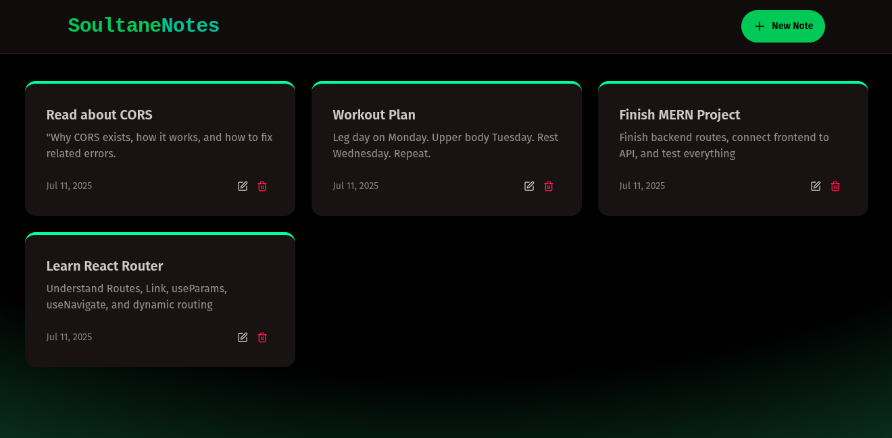

# 📝 SoultaneNotes — MERN Note-Taking App

**SoultaneNotes** is a modern fullstack MERN application that allows users to **create**, **view**, **update**, and **delete notes** in a clean, responsive interface. It's built with **React + Tailwind CSS + DaisyUI** on the frontend and **Express + MongoDB** on the backend.



## ⚙️ Tech Stack

### 🔹 Frontend
- **React 19** with Vite
- **Tailwind CSS** + DaisyUI
- **React Router v7**
- **Axios** for API calls
- **Lucide React Icons**
- **React Hot Toast** for notifications

### 🔹 Backend
- **Express.js**
- **MongoDB** & Mongoose
- **CORS** for cross-origin requests
- **dotenv** for environment variables
- **Rate limiting** with Upstash or Express middleware

## 🚀 Features

- 🧠 **CRUD functionality** (Create, Read, Update, Delete)
- 💅 **Clean dark UI** with DaisyUI and Tailwind CSS
- ⚡ **Instant feedback** with `react-hot-toast`
- 🔐 **Basic rate limiting** support
- 🧭 **Client-side routing** using `react-router`
- 📱 **Responsive design** that works on all devices
- 🎨 **Modern UI/UX** with smooth animations

## 📦 Installation

### Prerequisites
- Node.js (v18 or higher)
- MongoDB (local or cloud instance)
- npm or yarn

### 1. Clone the repository

```bash
git clone https://github.com/SoultaneRaqi/soultane-notes.git
cd soultane-notes
```

### 2. Install root dependencies (if any)

```bash
npm install
```

### 3. Install and run the backend

```bash
cd backend
npm install
npm run dev
```

### 4. Install and run the frontend

```bash
cd ../frontend
npm install
npm run dev
```

### 5. Environment Variables

Create a `.env` file inside the `backend` folder with the following content:

```env
PORT=5001
MONGO_URI=your_mongodb_connection_string
NODE_ENV=development
```

Replace `your_mongodb_connection_string` with your actual MongoDB connection string.

## 📂 Project Structure

```
soultane-notes/
├── backend/                  # Express server + MongoDB
│   ├── node_modules/
│   ├── src/
│   │   ├── config/          # Database configuration
│   │   ├── controllers/     # Route controllers
│   │   ├── middleware/      # Custom middleware
│   │   └── models/          # Mongoose models
│   ├── routes/              # API routes
│   ├── .env                 # Environment variables
│   ├── server.js            # Entry point
│   └── package.json
├── frontend/                 # React client (Vite + Tailwind)
│   ├── node_modules/
│   ├── public/
│   ├── src/
│   │   ├── components/      # Reusable UI components
│   │   │   ├── Navbar.jsx
│   │   │   ├── NoteCard.jsx
│   │   │   ├── NoteForm.jsx
│   │   │   └── NoteList.jsx
│   │   ├── pages/           # Page components
│   │   │   ├── HomePage.jsx
│   │   │   ├── NotePage.jsx
│   │   │   └── index.jsx
│   │   ├── App.jsx          # Main app component
│   │   └── main.jsx         # Entry point
│   ├── index.html
│   ├── package.json
│   ├── postcss.config.js
│   ├── tailwind.config.js
│   └── vite.config.js
├── .gitignore
├── package.json             # Root package.json
└── README.md
```

## 🧪 API Endpoints

| Method | Endpoint | Description |
|--------|----------|-------------|
| GET | `/api/notes` | Get all notes |
| GET | `/api/notes/:id` | Get note by ID |
| POST | `/api/notes` | Create a new note |
| PUT | `/api/notes/:id` | Update a note |
| DELETE | `/api/notes/:id` | Delete a note |

### Example API Usage

#### Create a Note
```bash
curl -X POST http://localhost:5001/api/notes \
  -H "Content-Type: application/json" \
  -d '{
    "title": "My First Note",
    "content": "This is the content of my note"
  }'
```

#### Get All Notes
```bash
curl http://localhost:5001/api/notes
```

## 🎨 Screenshots

### Main Dashboard


### Note Editor


## 🚀 Deployment

### Frontend (Vercel/Netlify)
1. Build the frontend: `npm run build`
2. Deploy the `dist` folder to your hosting platform

### Backend (Railway/Heroku)
1. Set up environment variables on your hosting platform
2. Deploy the backend folder
3. Update the frontend API base URL

## 🤝 Contributing

1. Fork the repository
2. Create a feature branch (`git checkout -b feature/amazing-feature`)
3. Commit your changes (`git commit -m 'Add some amazing feature'`)
4. Push to the branch (`git push origin feature/amazing-feature`)
5. Open a Pull Request

## 📝 License

This project is licensed under the MIT License - see the [LICENSE](LICENSE) file for details.

## 🔧 Development

### Running Tests
```bash
# Frontend tests
cd frontend
npm test

# Backend tests
cd backend
npm test
```

### Code Style
This project uses ESLint and Prettier for code formatting. Run:
```bash
npm run lint
npm run format
```

## 📧 Contact

**Your Name** - [@yourusername](https://twitter.com/yourusername) - your.email@example.com

Project Link: [https://github.com/yourusername/soultane-notes](https://github.com/yourusername/soultane-notes)

---

⭐ Don't forget to give the project a star if you found it helpful!